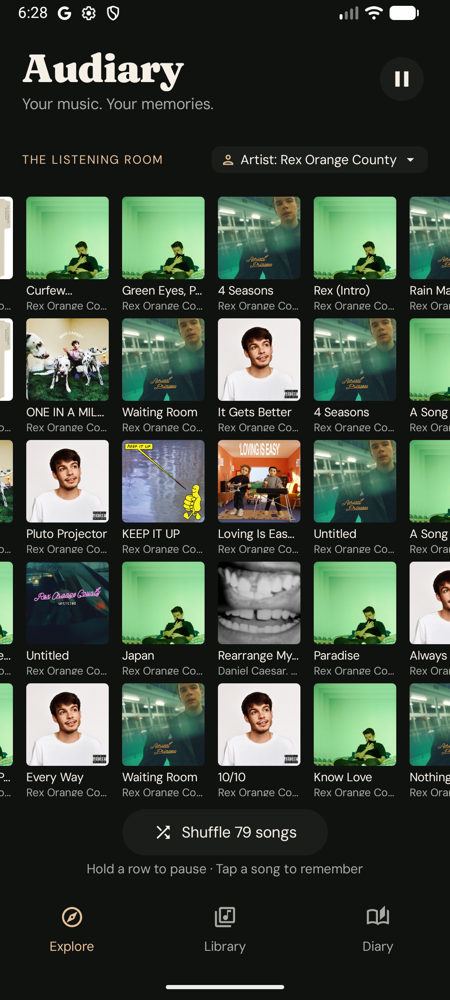
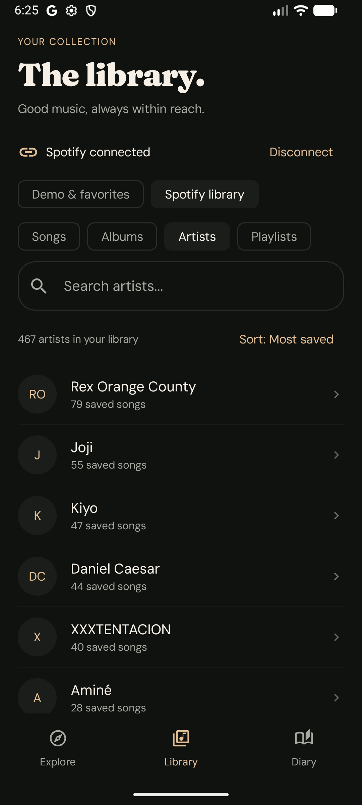
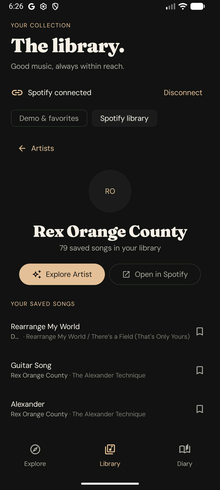

# Audiary

> *Your music. Your memories.*

Audiary is an editorial, high-aesthetic Android music discovery and journaling companion built with Jetpack Compose. Integrating seamlessly with the **Spotify Web API** via RFC 7636 PKCE OAuth, Audiary reimagines your personal streaming library into an ambient, tactile **Listening Room**—surfacing forgotten gems, curating focused artist sessions, and anchoring your memories to the songs that soundtrack your life.

---

## Preview

<p align="center">
  
  
  
</p>

<p align="center">
  
  
  
</p>

---

## Features

### 1. The Listening Room
- **Five-Row Animated Discovery Wall**: Continuously flowing horizontal music rows showcasing high-resolution album artwork from your real Spotify library.
- **Dynamic Source Selector**: Toggle your Listening Room's source on the fly between **All Saved Songs**, specific **Spotify Playlists**, individual **Artists**, or the **Offline Demo Collection**.
- **Progressive Background Prefetching**: Automatically expands the discovery pool to hundreds of tracks in the background with graceful rate-limit pacing.
- **Instant Offline Shuffle**: Shuffles across hundreds of in-memory cached songs instantaneously without triggering redundant network requests.
- **Interactive Controls**: Touch-and-hold to inspect details, pause/resume ambient row motion, and tap any song to record notes or view its track details.

### 2. High-Density Library & Infinite Scrolling
- **Compact Song Rows**: Optimized row spacing (~56dp) displaying title, artist, album, and bookmark actions with high information density.
- **Smooth Infinite Scrolling**: Eliminates pagination buttons by automatically prefetching and appending 40-track batches as you scroll near the bottom.
- **Library-Wide Artist Indexing**: Removes "current page" limitations by indexing your entire saved music library into a local SQLite database, computing exact saved counts for every artist.
- **Monogram Avatars & Sorting**: Clean monogram initials for every artist with sorting options by **Most saved**, **Fewest saved**, or alphabetical order (**A–Z**, **Z–A**).
- **Artist & Playlist Detail Views**: Dedicated detail hubs with "Explore Artist" / "Explore this playlist" quick actions and one-tap "Open in Spotify" deep links.

### 3. Musical Diary & Memory Journal
- **Song-Linked Notes**: Record reflections, memories, and personal thoughts anchored to individual songs.
- **Room Database Persistence**: Fully offline, crash-resilient storage ensuring your personal journal entries remain permanent.
- **Editorial Typography**: Styled with **Fraunces** for headings and branding, and **DM Sans** for metadata and reading comfort.

---

## Tech Stack & Architecture

- **UI & Design**: [Jetpack Compose](https://developer.android.com/jetpack/compose) with Material Design 3, custom typography (`Fraunces` variable serif and `DM Sans`), and dark editorial theming.
- **Architecture**: MVVM with unidirectional data flow (UDF), Kotlin Coroutines, and `StateFlow` reactive streams.
- **Local Persistence**: [Android Room Database](https://developer.android.com/training/data-storage/room) (SQLite) with relational DAOs for cached tracks, favorites, and diary notes.
- **Networking & Authentication**:
  - [OkHttp](https://square.github.io/okhttp/) HTTP engine.
  - **Spotify OAuth 2.0 PKCE** (RFC 7636): Secure code challenge and verifier generation, custom deep-link redirect processing (`com.example.audiary://callback`), and automatic token refresh with zero stored secrets.
  - Rate-limit backoff honoring Spotify's `Retry-After` headers.
- **Image Pipeline**: [Coil Compose](https://coil-kt.github.io/coil/) for asynchronous, cached image loading.
- **Testing**: JUnit 4, Kotlin Coroutines Test (`runTest`, `StandardTestDispatcher`), MockWebServer, and Android interaction tests.

---

## Getting Started

### Prerequisites
- Android Studio Hedgehog (2023.1.1) or newer
- JDK 21
- Android SDK Platform 34+ (Minimum SDK: 26)
- A Spotify Developer account

### Spotify Setup
1. Go to the [Spotify Developer Dashboard](https://developer.spotify.com/dashboard) and create a new application.
2. In your application settings, configure the following:
   - **Redirect URI**: `com.example.audiary://callback`
   - **APIs Used**: Web API
3. In your project's `local.properties` file, add your Client ID and redirect URI:
   ```properties
   spotify.clientId=YOUR_SPOTIFY_CLIENT_ID
   spotify.redirectUri=com.example.audiary://callback
   ```
4. Build and install the application:
   ```bash
   ./gradlew assembleDebug
   ```

---

## License

This project is licensed under the MIT License. See [LICENSE](LICENSE) for details.
